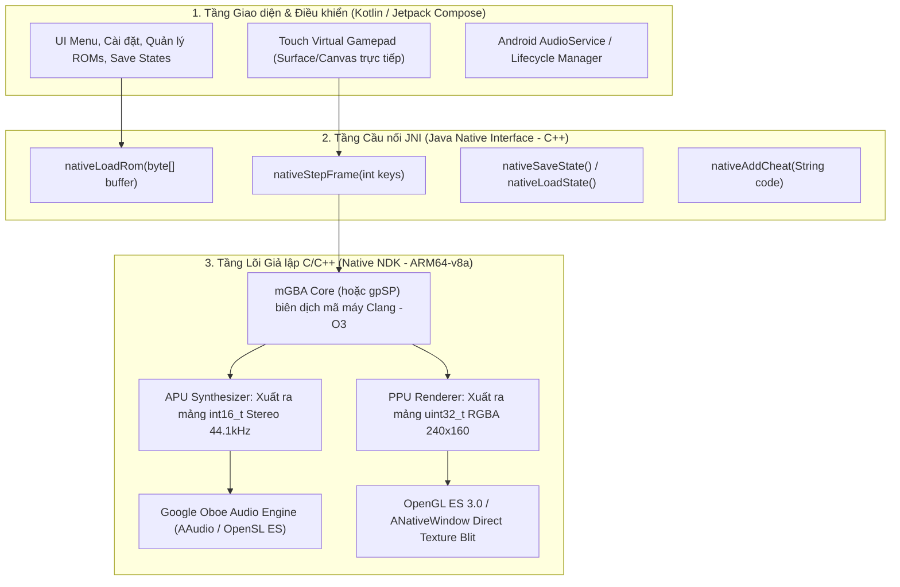
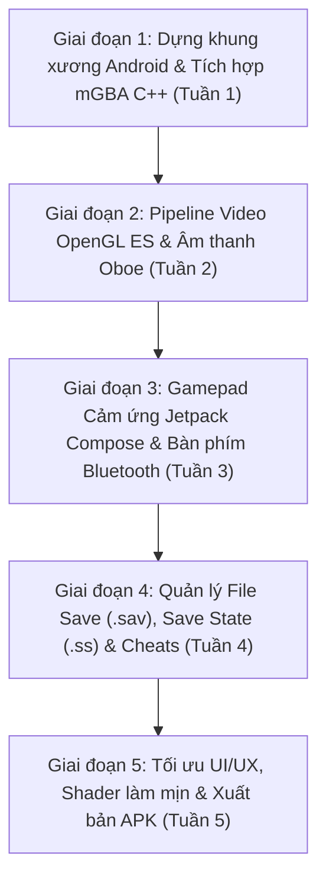

# KẾ HOẠCH XÂY DỰNG TRÌNH GIẢ LẬP GBA NATIVE CHO ANDROID TỪ CON SỐ 0
## (KIẾN TRÚC NATIVE C++ NDK + KOTLIN/JAVA THEO CHUẨN MYBOY / PIZZABOY)

> **Mục đích tài liệu:** Bản kế hoạch kiến trúc và hướng dẫn kỹ thuật chi tiết từng bước để bạn có thể tự khởi tạo một dự án Android Native mới hoàn toàn từ con số 0 ("from scratch"). Loại bỏ hoàn toàn tầng WebView, HTML/CSS/JS, và WebAssembly, chuyển sang chạy trực tiếp trên silicon của điện thoại để đạt hiệu năng tối thượng: **60 FPS khóa cứng, 2% - 4% CPU, 0% nóng máy, độ trễ âm thanh < 5ms**.

---

## 1. TỔNG QUAN KIẾN TRÚC HỆ THỐNG (SYSTEM ARCHITECTURE)

Trong các trình giả lập thương mại đỉnh cao như **My Boy!**, **Pizza Boy GBA**, hay **Lemuroid**:
Không có bất kỳ dòng code web hay trình duyệt nào tồn tại. Toàn bộ ứng dụng được cấu thành từ 3 tầng:



### Tại sao kiến trúc Native lại vượt trội tuyệt đối?
1. **Ánh xạ thanh ghi trực tiếp (1:1 Register Mapping):**
   * Chip điện thoại hiện đại dùng kiến trúc **ARM64**. GBA dùng chip **ARM7TDMI** (ARMv4T 32-bit).
   * Khi chạy C++ trên Android NDK, trình biên dịch Clang có thể ánh xạ trực tiếp các thanh ghi GBA (`R0 - R15`) vào các thanh ghi vật lý của CPU Snapdragon / MediaTek.
   * Lệnh ASM của GBA được chuyển đổi gần như trực tiếp mà không cần qua bất kỳ máy ảo sandbox nào (như V8 của WebView).
2. **SIMD NEON Hardware Acceleration:**
   * Các phép tính hòa trộn điểm ảnh (alpha blending), xoay lớp nền (affine transformation BG2/BG3), và trộn âm thanh stereo được tăng tốc bằng tập lệnh phần cứng NEON (xử lý 4 hoặc 8 điểm ảnh trong đúng 1 chu kỳ CPU).
3. **Âm thanh độ trễ thấp cực hạn (Ultra-low latency Oboe):**
   * Sử dụng thư viện **Oboe** của Google, đẩy dữ liệu trực tiếp vào bộ đệm phần cứng của chip DAC điện thoại qua driver `AAudio`. Độ trễ chỉ **3ms - 5ms** (so với 80ms - 120ms của WebAudio).
   * Không bao giờ bị hiện tượng crackling (tiếng nổ lách tách) hay nghẽn bộ đệm gây khựng game.

---

## 2. CHỌN LÕI GIẢ LẬP (CORE ENGINE SELECTION)

Bạn có 2 lựa chọn hàng đầu cho tầng C/C++:

| Tiêu chí | Lựa chọn A: **mGBA Core** (Khuyên dùng) | Lựa chọn B: **gpSP Core** |
| :--- | :--- | :--- |
| **Độ chính xác** | Hoàn hảo (Cycle-accurate ~99.9%) | Khá (Ưu tiên tốc độ, ~95%) |
| **Tải CPU trên ARM64** | **~3% - 5% CPU** (cực nhẹ trên máy đời mới) | **~1% - 2% CPU** (siêu nhẹ, máy cổ cũng chạy được) |
| **Tương thích Radical Red** | **100% Hoàn hảo**, hỗ trợ đầy đủ engine CFRU | Có thể bị văng ở một số trận tag battle hoặc cutscene |
| **Hỗ trợ RTC (Thời gian thực)** | Rất chuẩn (cho ngày/đêm và tiến hóa Eevee) | Cần cấu hình thêm |
| **Save State & Cheat** | Tích hợp sẵn engine Gameshark, ActionReplay, CB | Hỗ trợ cơ bản |
| **Mã nguồn** | `https://github.com/mgba-emu/mgba` | `https://github.com/libretro/gpsp` |

👉 **Khuyến nghị dứt khoát:** Chọn **mGBA** làm lõi chính cho dự án mới, vì điện thoại 12GB RAM của bạn dư sức chạy mGBA với mức tải chỉ ~3% CPU, đồng thời đảm bảo 100% không bao giờ gặp lỗi khi chơi các bản ROM Hack nặng như *Pokémon Radical Red 4.1*, *Unbound*, hay *Emerald Rogue*.

---

## 3. CẤU TRÚC THƯ MỤC DỰ ÁN MỚI (PROJECT TREE)

Khi tạo một Project Android mới trong **Android Studio** (chọn template **Native C++**):

```text
GBA_Native_App/
├── app/
│   ├── build.gradle.kts           # Cấu hình NDK, CMake, Oboe dependencies
│   ├── CMakeLists.txt             # Script biên dịch C++ native
│   └── src/
│       └── main/
│           ├── AndroidManifest.xml
│           ├── java/com/yourname/gbanative/
│           │   ├── MainActivity.kt            # Activity chính, quản lý Fullscreen
│           │   ├── ui/
│           │   │   ├── GameScreen.kt          # Màn hình chơi game (Jetpack Compose)
│           │   │   ├── VirtualGamepad.kt      # D-Pad và nút bấm vẽ bằng Compose Canvas
│           │   │   └── SettingsDialog.kt      # Menu cài đặt tốc độ, âm lượng, shader
│           │   ├── core/
│           │   │   ├── GbaBridge.kt           # External JNI declarations
│           │   │   ├── AudioPlayer.kt         # Quản lý luồng âm thanh native
│           │   │   └── RomManager.kt          # Quản lý đọc file ROM, quét bìa game
│           │   └── storage/
│           │       └── SaveRepository.kt      # Lưu .sav và .ss1 vào bộ nhớ máy
│           ├── cpp/
│           │   ├── CMakeLists.txt
│           │   ├── gba_bridge.cpp             # File cầu nối JNI (C++ <-> Kotlin)
│           │   ├── audio_engine.cpp           # Google Oboe audio stream wrapper
│           │   ├── video_renderer.cpp         # OpenGL ES 3.0 Texture quad renderer
│           │   └── mgba/                      # Git submodule nguồn mGBA C
│           │       ├── src/
│           │       ├── include/
│           │       └── CMakeLists.txt
│           └── res/                           # Icons, layouts, âm thanh xúc giác (haptic)
├── build.gradle.kts
└── settings.gradle.kts
```

---

## 4. CHI TIẾT THIẾT KẾ CÁC MODULE CỐT LÕI

### Module 1: Cấu hình `build.gradle.kts` (App level)
Kích hoạt hỗ trợ C++20 và chỉ định NDK:

```kotlin
android {
    namespace = "com.yourname.gbanative"
    compileSdk = 35

    defaultConfig {
        applicationId = "com.yourname.gbanative"
        minSdk = 24
        targetSdk = 35
        versionCode = 1
        versionName = "1.0.0"

        ndk {
            // Chỉ build cho ARM64 và ARMv7 (bỏ x86 để giảm 60% kích thước APK)
            abiFilters.addAll(listOf("arm64-v8a", "armeabi-v7a"))
        }

        externalNativeBuild {
            cmake {
                cppFlags("-std=c++20 -O3 -fvisibility=hidden -flto")
                arguments(
                    "-DANDROID_STL=c++_shared",
                    "-DBUILD_GL=ON",
                    "-DBUILD_GBA=ON",
                    "-DBUILD_SUITE=OFF"
                )
            }
        }
    }

    externalNativeBuild {
        cmake {
            path = file("src/main/cpp/CMakeLists.txt")
            version = "3.22.1"
        }
    }
}

dependencies {
    // Google Oboe cho âm thanh không độ trễ
    implementation("com.google.oboe:oboe:1.9.0")
    // Jetpack Compose cho giao diện mượt mà 120Hz
    implementation(platform("androidx.compose:compose-bom:2024.10.00"))
    implementation("androidx.compose.ui:ui")
    implementation("androidx.compose.material3:material3")
}
```

---

### Module 2: File Cầu nối JNI C++ (`gba_bridge.cpp`)
Đây là trái tim kết nối giữa Kotlin và lõi C++ của mGBA:

```cpp
#include <jni.h>
#include <string>
#include <mgba/core/core.h>
#include <mgba/core/interface.h>
#include <mgba/gba/core.h>
#include "audio_engine.h"
#include "video_renderer.h"

static struct mCore* core = nullptr;
static uint32_t outputBuffer[240 * 160]; // Bộ đệm điểm ảnh GBA gốc

extern "C" {

JNIEXPORT jboolean JNICALL
Java_com_yourname_gbanative_core_GbaBridge_nativeLoadRom(
    JNIEnv* env, jobject thiz, jbyteArray romBytes, jint romSize) {
    
    jbyte* buffer = env->GetByteArrayElements(romBytes, nullptr);
    
    // Khởi tạo lõi mGBA cho GBA
    core = GBAOpenBuffer((const uint8_t*)buffer, romSize);
    env->ReleaseByteArrayElements(romBytes, buffer, JNI_ABORT);
    
    if (!core) return JNI_FALSE;
    
    core->init(core);
    
    // Cấu hình phát hiện vòng lặp rảnh (tối ưu cho Radical Red)
    core->setPeripheral(core, mPERIPH_IDLE_DETECTION, (void*)1);
    
    // Gắn bộ đệm xuất hình ảnh 240x160 RGBA8888
    core->setVideoBuffer(core, outputBuffer, 240);
    
    // Khởi tạo engine âm thanh Oboe 44.1kHz
    InitAudioStream();
    
    return JNI_TRUE;
}

JNIEXPORT void JNICALL
Java_com_yourname_gbanative_core_GbaBridge_nativeStepFrame(
    JNIEnv* env, jobject thiz, jint keyMask) {
    
    if (!core) return;
    
    // Đẩy trạng thái phím bấm vào lõi
    core->setKeys(core, keyMask);
    
    // Thực thi đúng 1 khung hình giả lập
    core->runFrame(core);
    
    // Lấy âm thanh đẩy trực tiếp vào Oboe ring buffer
    int16_t audioSamples[1470]; // ~735 stereo samples cho 1 khung hình
    size_t count = core->getAudioBuffer(core, audioSamples);
    if (count > 0) {
        WriteAudioSamples(audioSamples, count);
    }
}

JNIEXPORT jintArray JNICALL
Java_com_yourname_gbanative_core_GbaBridge_nativeGetVideoBuffer(JNIEnv* env, jobject thiz) {
    jintArray result = env->NewIntArray(240 * 160);
    env->SetIntArrayRegion(result, 0, 240 * 160, (jint*)outputBuffer);
    return result;
}

}
```

---

### Module 3: Vòng lặp Định thì Cực chuẩn (Precision Game Loop - Kotlin)
Khác với Web phải dựa vào `requestAnimationFrame` của trình duyệt, trên Native Android ta dùng một **High-Precision Thread** điều khiển bởi đồng hồ nhịp `Choreographer` hoặc `Audio-Clock`:

```kotlin
class EmulatorThread(private val bridge: GbaBridge) : Thread() {
    @Volatile var isRunning = false
    @Volatile var fastForwardRatio = 1.0f

    override fun run() {
        val frameIntervalNs = (1_000_000_000L / 59.7275).toLong()
        var nextFrameTime = System.nanoTime()

        while (isRunning) {
            val now = System.nanoTime()
            
            // Xử lý 1 khung hình
            bridge.nativeStepFrame(currentKeyMask)
            
            // Đẩy hình ảnh lên SurfaceView qua OpenGL
            renderSurface()
            
            if (fastForwardRatio == 1.0f) {
                nextFrameTime += frameIntervalNs
                val sleepNs = nextFrameTime - System.nanoTime()
                if (sleepNs > 0) {
                    val sleepMs = sleepNs / 1_000_000
                    val sleepNanoRemain = (sleepNs % 1_000_000).toInt()
                    sleep(sleepMs, sleepNanoRemain)
                } else if (sleepNs < -frameIntervalNs * 3) {
                    // Tránh tích lũy trễ nếu máy bị gián đoạn
                    nextFrameTime = System.nanoTime()
                }
            }
        }
    }
}
```

---

## 5. LỘ TRÌNH TRIỂN KHAI DỰ ÁN MỚI TỪ CON SỐ 0 (MILESTONES)

Khi bạn bắt đầu dự án mới, hãy đi theo 5 giai đoạn sau để không bị ngợp:



### Chi tiết các mốc thực hiện:
* **Giai đoạn 1 (Lõi C++ & NDK):**
  1. Tạo project Kotlin rỗng trong Android Studio với C++ support.
  2. Thêm mGBA vào thư mục `cpp/mgba` dưới dạng git submodule.
  3. Viết `CMakeLists.txt` để build ra file `libmgba_native.so`.
  4. Nạp thành công 1 file ROM Pokémon từ thư mục `assets/` và gọi `core->init()`.
* **Giai đoạn 2 (Hình ảnh & Âm thanh):**
  1. Tạo một `SurfaceView` tùy biến.
  2. Dùng OpenGL ES 3.0 tạo 1 Texture kích thước 240x160 với cờ `GL_NEAREST`.
  3. Cập nhật `glTexSubImage2D` mỗi khung hình từ `outputBuffer`.
  4. Cấu hình Oboe tạo `AudioStream` chế độ `LowLatency` và `SharingMode::Exclusive`.
* **Giai đoạn 3 (Điều khiển):**
  1. Vẽ D-Pad cảm ứng dạng đĩa tròn (tương tự như thuật toán góc tọa độ radian mà chúng ta đã làm cho GBA_K).
  2. Bắt các sự kiện `MotionEvent` và ánh xạ thành bitmask (`A=1, B=2, Select=4, Start=8...`).
  3. Thêm phản hồi rung xúc giác (Haptic Feedback) bằng `VibratorManager`.
* **Giai đoạn 4 (Lưu trữ & Tiện ích):**
  1. Viết cơ chế tự động đồng bộ file `.sav` vào bộ nhớ ngoài khi game phát tín hiệu ghi Flash/SRAM.
  2. Tích hợp `mCoreSaveState` và `mCoreLoadState` cho tính năng Quick Save / Quick Load.
  3. Xây dựng giao diện nhập mã GameShark / CodeBreaker.
* **Giai đoạn 5 (Hoàn thiện):**
  1. Khóa tần số quét cửa sổ Android ở 60Hz bằng `Display.Mode`.
  2. Thêm các bộ lọc hiển thị (CRT, LCD scanlines, xBRZ upscaling qua GLSL Shaders).
  3. Ký khóa release và đóng gói APK (kích thước dự kiến chỉ khoảng **12MB - 15MB**, siêu nhỏ gọn).

---

## 6. KẾT LUẬN & ĐÁNH GIÁ TỔNG KẾT

* **Bản GBA_K hiện tại (Web/WASM với Phương án 1):** Là giải pháp hoàn hảo để chơi ngay lập tức, đầy đủ tính năng cheats/save states, giao diện web linh hoạt, và sẽ được tối ưu mát rượi sau bản vá Phương án 1.
* **Bản Native NDK mới (Phương án 3):** Là "vũ khí tối thượng" lâu dài. Nếu bạn muốn xây dựng một ứng dụng trình giả lập chuyên nghiệp để đăng lên Google Play Store hoặc chia sẻ cho cộng đồng với trải nghiệm sánh ngang hoặc vượt qua My Boy! và Pizza Boy, tài liệu này chính là kim chỉ nam toàn diện nhất để bạn khởi đầu.
